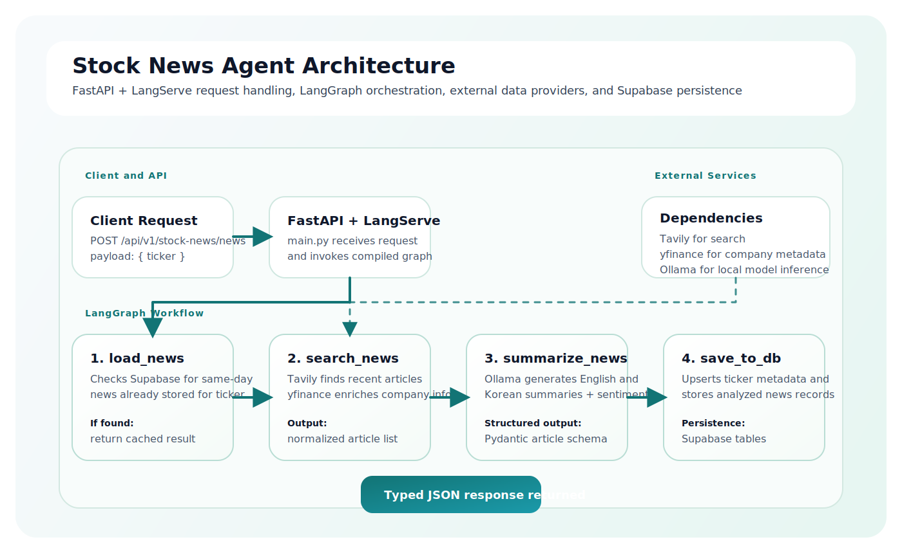
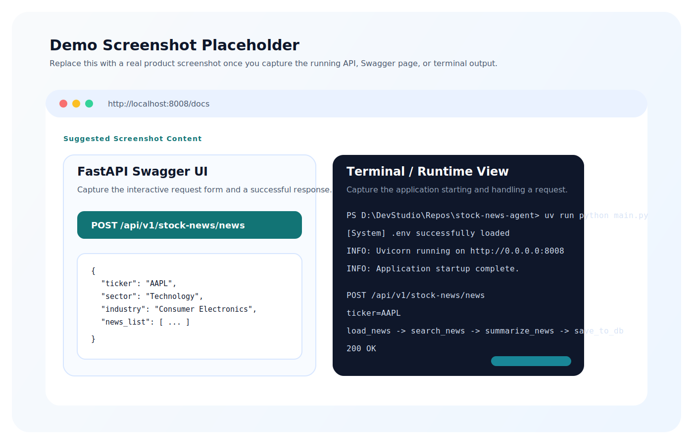

# Stock News Agent

A production-style AI workflow that collects market news for a stock ticker, summarizes each article in English and Korean, scores sentiment, and persists the results to Supabase.

This project is built as a LangGraph-based agent and exposed through FastAPI and LangServe, making it suitable both as a backend service and as an example of applied agent architecture for financial intelligence workflows.


## Overview

The system accepts a stock ticker, checks whether fresh news already exists for the current day, fetches new articles when needed, runs structured LLM analysis, and stores the results for downstream use.

It demonstrates several patterns that are valuable in real AI product development:

- stateful orchestration with LangGraph
- external data acquisition with Tavily and yfinance
- structured LLM output with Pydantic schemas
- bilingual summarization and sentiment analysis
- API-first delivery with FastAPI and LangServe
- persistent storage with Supabase

## What It Does

- Loads same-day news from Supabase when it already exists for the requested ticker.
- Searches recent stock-related news when no cached records are available.
- Enriches the request with company, sector, and industry metadata from yfinance.
- Uses a local Ollama model to generate structured analysis for each article.
- Produces English and Korean summaries and Korean content translations.
- Assigns article-level sentiment labels and scores.
- Exposes the workflow through both a custom REST endpoint and a LangServe route.

## Architecture

The core workflow is implemented as a LangGraph state machine.



The diagram below shows how the API layer, LangGraph workflow, model inference, and persistence layer interact during a request.

### Workflow Nodes

- `load_news`: checks Supabase for same-day news for the requested active ticker.
- `search_news`: queries Tavily for recent relevant articles and attaches company metadata.
- `summarize_news`: uses Ollama with structured output to create bilingual summaries and sentiment analysis.
- `save_to_db`: upserts ticker metadata and stores analyzed news records in Supabase.

## Tech Stack

- Python 3.13
- LangGraph, LangChain, LangServe
- FastAPI, Uvicorn
- Ollama for local inference
- Tavily for news search
- yfinance for company metadata
- Supabase for persistence
- Pydantic for response and state schemas
- uv for dependency and environment management

## API Surface

### Custom endpoint

`POST /api/v1/stock-news/news`

Request body:

```json
{
	"ticker": "AAPL"
}
```

Response shape:

```json
{
	"ticker": "AAPL",
	"industry": "Consumer Electronics",
	"sector": "Technology",
	"news_list": [
		{
			"id": 1,
			"title": "...",
			"content": "...",
			"content_kr": "...",
			"summary": "...",
			"summary_kr": "...",
			"published_date": "2026-06-08T12:34:56+00:00",
			"url": "https://...",
			"sentiment_label": "Positive",
			"sentiment_score": 0.74
		}
	]
}
```

### LangServe route

`/agent`

This route exposes the LangGraph workflow directly through LangServe for experimentation and agent-focused integration.

## Project Structure

```text
.
├── main.py                  # FastAPI application entrypoint
├── agent/
│   ├── stock_news_agent.py  # LangGraph definition
│   ├── state.py             # Shared workflow state and schemas
│   ├── nodes/               # Workflow node implementations
│   └── utils/               # Search, metadata, LLM, and data clients
├── data/
│   └── schema.sql           # Supabase schema
├── notebooks/               # Local experimentation and visualization
└── main.spec                # PyInstaller packaging configuration
```

## Local Setup

### 1. Install dependencies

```powershell
uv sync
```

### 2. Create a `.env` file in the project root

Required variables:

```env
SUPABASE_URL=your_supabase_url
SUPABASE_KEY=your_supabase_service_key
TAVILY_API_KEY=your_tavily_api_key
```

### 3. Prepare the database

Run the SQL in `data/schema.sql` against your Supabase project.

### 4. Start Ollama and pull the required model

```powershell
ollama pull qwen3.5:9b
ollama serve
```

### 5. Run the API locally

```powershell
uv run python main.py
```

The API starts on `http://localhost:8008`.

## Example Request

```powershell
Invoke-RestMethod `
	-Method Post `
	-Uri http://localhost:8008/api/v1/stock-news/news `
	-ContentType 'application/json' `
	-Body '{"ticker":"AAPL"}'
```

## Demo Screenshots

### API Demo Preview



Suggested real screenshots to replace this placeholder later:

- FastAPI Swagger page for `POST /api/v1/stock-news/news`
- terminal run showing the app booting on port `8008`
- JSON response example for a ticker such as `AAPL` or `NVDA`

## Current Limitations

- The project currently has no automated test suite.
- Error handling and observability can be expanded for production readiness.
- The current workflow focuses on a single ticker request at a time.
- Secrets and deployment steps are not yet packaged for one-command onboarding.

## Roadmap

- Add automated tests for nodes, API routes, and schema validation.
- Add logging, tracing, and failure recovery for external dependencies.
- Introduce deployment assets such as Docker and CI workflows.
- Extend the agent into a larger multi-agent investment research system.
- Add retrieval or vector search for historical news analysis.

## License

No license file is currently included in this repository.
